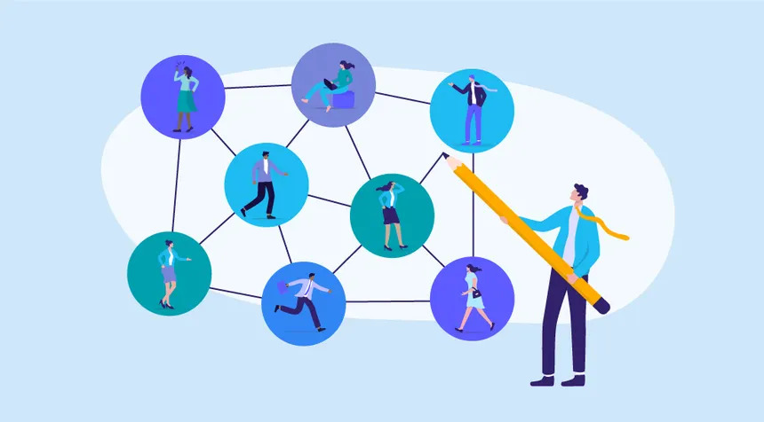

## 30Days_Of_Learning
A journal showing all the new things i would have learnt from March 1 - March 30 2025  

 Day 01 - March 1, 2025 
  

### Goal For Today: Learn Advanced Excel Functions  

#### What I Learned Today:  
* I learnt how to apply VLOOKUP function to a data table in Excel.  
* I also learned how to apply XLOOKUP function to a data table in Excel.  
* I learnt how to use the TODAY function to get add a Date column to an Excel table, as well as how to use the NOW function to provide Date in Timestamp form.  
#### Challenge Faced:
* The XLOOKUP function was not available in my Excel version (Excel 2019).  
#### How I Overcame Challenges:  
* I had to use Excel on the Web where i could easily use the function to practice.  
#### Practice:  
* I applied the VLOOKUP and XLOOKUP functions to a table in order to find out the prices of Sugar Cookie and Chocolate Chip.  

  

* I practiced how to use the TODAY() and NOW() functions.  

#### Reflection:  
* Even though the VLOOKUP is quite useful, the XLOOKUP seems easier to use because it focuses more on columns, therefore, making it easier to capture targeted detail(s).  

  

  

 Day 02 - March 2, 2025 
  

### Goal For Today: Understanding The Data Analysis Process  

  

#### What I Learned Today:  
* I learnt that there are rules that guide the actions of every data analyst from the moment they are tasked with a problem till they present their findings to stakeholders.  
* I realized that some stages tend to overlap and may be repetitive, for instance, the Data Cleaning phase. Still on the Data Cleaning phase, i learnt that data analysts must always bear in mind that all data gathered/sourced for any project/task are never clean enough and so must ensure that even though the data is not thoroughly cleaned, it should be far cleaner than when they had first received them.  
* I learnt that even though there are numerous tools for data analysis at the disposal of the analyst, they must ensure that the tools they choose for the analytical process must be compatible with the data sourced.  
* i also learnt that data visualization options must be applied with their target audience at heart. In otherwords, the choice of data visualization must be easy to understand by the target audience so that the analytical process can be more meaningful.  
* I learnt that communicating facts that have been gleamed from the data must be conducted in very comprehensible language so that the target audience can understand the message being passed.  

#### Reflections:  
A data analyst's job is never done until the message is perfectly understood by the target audience. Therefore, we should as much as we can ensure that people comprehend what we are doing, else, the entire process would be meaningless.  

  

  

 Day 03 - March 3, 2025 
  

### Goal For Today: The 10,000-hour rule  

  

  

#### What I Learned Today:  
* I learnt that Anders Ericsson, a psychologist, posited that for anyone to be great at something, they have to dedicate a minimum of 10,000 hours to learning that thing. In other words, if you want to be great at something, you have to put in a minimum of 10,000 hours of deliberate, structured, and focused practice. His research helps us to learn and improve easier and much faster. But it all depends on just how far you are willing to go at that thing, and provided the rules guiding it (that new thing you are learning) do not change.  
This theory was made popular by Malcolm Gladwell.  

#### Reflection:  
To be better than 95% of people in an industry, i need to dedicate a minimum of 18 minutes of focused learning per day at one thing.  

  

  

 Day 04 - March 4, 2025 
  

### Goal For Today: How data is the oil of the 21st century  

  

  

#### What I Learnt Today:  
"Information is the oil of the 21st century, and analytics is the combustion engine " - Peter Sondergaard.

By this comparison, the importance of data and its processing in the 21st century is made clear.
Oil was the most importance resource of the 20th century. Today, data is the most valuable resource. And just as oil is of little relevance until refined, the true value of data remains untapped until it gets analyzed. Similarly, as a combustion engine transforms oil into energy, data analytics transforms information into insights that drive decisions, and give a competitive edge.
So, all economic agents (individuals, businesses, governments, etc) rely on data for a competitive edge.  

  

 Day 05 - March 5, 2025  
  

### Goal For Today: How your choice of browser reflects your I/Q  

  

#### What I Learnt Today:  
According to an online article at theatlantic.com, Chrome and Firefox Users Make Better Employees! This is a surprising finding but has been discussed in a few informal studies or surveys. While no definitive large-scale academic study has made this claim, it's often shared through articles on sites like Harvard Business Review or Medium, where correlations between browsing behavior and work performance have been speculated. You might find these mentioned in business or workplace studies on productivity and technology adoption.  
So, which browser are you using?  

  

  

 Day 06 - March 6, 2025 
  

### Goal For Today:  Crime Organizations Of The Past And The Current Wealth Of Rich Countries  

  

  

#### What I Learnt Today:  
The relationship between past crime organizations and current economic development in rich countries is multifaceted. Historically, organized crime has often thrived in environments where central governments and civil society are disorganized, weak, or untrustworthy. This can occur during periods of political, economic, or social turmoil or transition, such as changes in government or rapid economic development.  

In many rich countries, the legacy of organized crime can be seen in several ways:  
Economic Impact: Organized crime groups have historically engaged in a variety of illegal activities, including drug trafficking, money laundering, and fraud. These activities can distort economic markets, divert resources from productive uses, and create inefficiencies. For example, the United States Drug Enforcement Administration (DEA) has identified Mexican transnational criminal organizations (TCOs) as the greatest criminal drug threat to the United States, highlighting their dominance in drug trafficking.  
Institutional Weakness: The presence of organized crime can weaken institutions, including law enforcement and the judiciary. This can lead to a lack of trust in these institutions, which is crucial for economic development. Strong and trustworthy institutions are essential for maintaining the rule of law, protecting property rights, and ensuring a stable business environment.  
Social Control: Criminal organizations often seek to develop social control over specific communities, which can lead to a parallel system of governance. This can undermine the legitimacy of the state and create areas where the state has limited influence. For instance, in some regions, criminal groups provide protection and social services, which can make it difficult for the state to regain control.  
Economic Inequality: There is compelling evidence that economic inequality is positively correlated with crime. Economic inequality can alienate individuals from societal institutions and values, leading to social resistance and engagement in criminal behavior. This relationship has been studied in various contexts, including developed countries, where economic inequality can contribute to higher crime rates.  
Historical Context: In some cases, the historical presence of organized crime has left a lasting impact on the economic and social fabric of a country. For example, the legacy of the Italian Mafia in Italy and the Yakuza in Japan has influenced the development of these countries' economies and social structures. These organizations have sometimes been integrated into legitimate business activities, creating a complex interplay between legal and illegal economies.  
Policy Implications: Understanding the historical relationship between organized crime and economic development is crucial for policymakers. Interventions that aim to reduce economic inequality and strengthen institutions can help mitigate the negative impacts of organized crime. For example, public participation programs and efforts to improve financial literacy can help reduce social resistance and the propensity for criminal behavior.
In summary, the relationship between past crime organizations and current economic development in rich countries is characterized by the impact of organized crime on economic markets, institutional strength, social control, and economic inequality. Addressing these issues is essential for fostering sustainable economic development and reducing the influence of organized crime.  

  

  

#### SOURCES:  
[The Guardian](https://www.theguardian.com/business/2025/mar/03/soaring-uk-crime-cost-up-policy-exchange-policing-prisons)  

[Global Initiative](https://globalinitiative.net/analysis/cross-cutting-threat-to-development/)  

[Lemonade](https://www.lemonde.fr/en/sports/article/2024/10/30/the-calabrian-mafia-s-hold-on-milan-s-football-stands_6730976_9.html)  

[Sage Pub](https://journals.sagepub.com/doi/10.1177/1088767907311849)  

[The Wall Street Journal](https://www.wsj.com/world/europe/europe-drugs-gangs-organized-crime-netherlands-6f58ea45)  

[Brookings](https://www.brookings.edu/articles/is-the-risk-of-crime-against-businesses-greater-in-more-unequal-countries/)  

  

  

  Day 08 - March 8, 2025 
  

### Goal For Today:  Feminine Hurricane Names And Increased Deadliness  
  

#### What I Learnt Today: 
Feminine Hurricane Names and Increased Deadliness: This is a well-known finding from a study published in Nature Geoscience (2014), which found that hurricanes with feminine names are deadlier than those with masculine names, primarily due to implicit biases. The study was conducted by researchers at the University of Illinois and the University of Michigan, and it looked at the effect of names on public perception and preparedness. You can find it referenced in news articles about gender bias, such as The New York Times and The Guardian.  

  

  

  Day 10 - March 10, 2025 
  

### Goal For Today:  Maternal Mortality In Sub-Saharan Africa  

  

  

#### What I Learnt Today:  
Maternal mortality in Sub-Saharan Africa remains a significant health challenge, despite global efforts to improve maternal health outcomes. The region has some of the highest maternal mortality ratios (MMR) in the world. Several factors contribute to this, including limited access to quality healthcare, poor infrastructure, and socioeconomic disparities. Here's an overview of the situation:  

##### 1. **Maternal Mortality Rate (MMR) in Sub-Saharan Africa**  
- Sub-Saharan Africa accounts for **66% of global maternal deaths**, even though the region represents about 13% of the global population.  
- The maternal mortality ratio in Sub-Saharan Africa is estimated to be about **542 deaths per 100,000 live births** (as of the most recent estimates), significantly higher than the global average of around **211 deaths per 100,000 live births**.  
- Some countries, such as **Chad, Sierra Leone, and Nigeria**, have particularly high MMRs, while others have made significant progress in reducing maternal deaths.  

##### 2. **Key Factors Contributing to Maternal Mortality**  
- __Lack of Access to Quality Healthcare__: Many women in rural and remote areas lack access to skilled birth attendants, emergency obstetric care, and essential healthcare services, especially during childbirth.  
- __Inadequate Infrastructure__: Poor healthcare infrastructure, such as a lack of hospitals, clinics, and transportation facilities, complicates access to timely care.  
- __Limited Financial Resources__: The cost of healthcare, even when available, can be prohibitive for many families in Sub-Saharan Africa, leading to delays in seeking care or not seeking care at all.
- __Malnutrition and Pre-existing Health Conditions__: High rates of malnutrition, anemia, and other health conditions such as HIV/AIDS, malaria, and tuberculosis can increase the risk of complications during pregnancy and childbirth.  
- __Cultural and Socioeconomic Barriers__: In some regions, cultural beliefs and practices may discourage women from seeking formal medical care, opting instead for traditional birth attendants or home births. Additionally, gender inequality, early marriages, and low education levels among women may restrict their access to healthcare.  
- __Unmet Family Planning Needs__: High fertility rates and a lack of access to contraceptive methods contribute to unplanned pregnancies, which can increase maternal risks, especially among adolescents.  

##### 3. **Major Causes of Maternal Deaths**  
- **Hemorrhage (excessive bleeding)**: This is one of the leading causes of maternal death, especially in the aftermath of complicated births.  
- __Infections__: Puerperal sepsis (infection after childbirth) and other infections during pregnancy and childbirth contribute significantly to maternal mortality.  
- __Hypertensive Disorders__: Conditions like preeclampsia and eclampsia (high blood pressure during pregnancy) are significant causes of maternal death.  
- __Obstructed Labor__: When labor cannot proceed normally, often due to the baby being too large or malpositioned, it can lead to life-threatening complications.  
- __Unsafe Abortion__: In regions where abortion is highly restricted, women may resort to unsafe procedures, leading to complications and maternal deaths.  

##### 4. **Progress and Efforts to Reduce Maternal Mortality**  
__Improved Access to Family Planning__: Expanding access to family planning and contraceptive services has been a key strategy in reducing unintended pregnancies and improving maternal health.  
__Skilled Birth Attendants and Emergency Care__: Many countries in the region have focused on increasing the number of skilled birth attendants (doctors, nurses, and midwives) and providing emergency obstetric care.  
__Health Financing and Investments__: Increasing investments in maternal health, including improving the supply of medicines, equipment, and training healthcare providers, can make a significant difference.  
__Community Health Programs__: Community-based health workers and programs that focus on education, vaccination, and early intervention have been successful in raising awareness about maternal health.  
__Global and Regional Initiatives__: Organizations like the **World Health Organization (WHO)**, **United Nations Population Fund (UNFPA)**, and **African Union (AU)** have launched several initiatives aimed at reducing maternal mortality, such as the **Sustainable Development Goal (SDG) 3** to reduce the global maternal mortality ratio to less than 70 per 100,000 live births by 2030.  
__Improving Antenatal and Postnatal Care__: More emphasis is being placed on quality antenatal care to monitor and prevent complications during pregnancy and improve postnatal care, especially for newborns and mothers in the postpartum period.  

##### 5. **The Way Forward**  
__Strengthening Health Systems__: There is a need to ensure health systems are equipped to provide quality, affordable, and accessible maternal health services, including emergency care.  
__Addressing Social Determinants__: Reducing maternal mortality requires addressing broader social and economic factors, such as gender inequality, poverty, and education.
__Engaging Men and Communities__: Engaging families, men, and communities in maternal health efforts can lead to better health outcomes for women. This involves promoting the value of maternal health and encouraging support for women during pregnancy and childbirth.  

In summary, while significant challenges remain, Sub-Saharan Africa has made progress in addressing maternal mortality, and continued investments in healthcare, education, and social reforms are essential to further reducing maternal deaths in the region.  

  

  

 Day 11 - March 11, 2025 
  

### Goal For Today:  A Look At Some Unproductive Establishments  

#### What I Learnt Today:  
Several government parastatals in Nigeria have been identified as receiving funding but not effectively fulfilling their mandates. Notable examples include:  

**1. Nigerian Hydrocarbon Pollution Remediation Project (HYPREP):**  
Established to address oil pollution in the Niger Delta, HYPREP has faced significant criticism for its ineffectiveness. Leaked documents and satellite imagery from 2021 revealed that cleanup sites remained heavily polluted. Issues such as the selection of unqualified contractors, inadequate laboratory analyses, and corruption have been highlighted. The United Nations eventually withdrew its support in 2023 due to these challenges.  
[HYPREP](https://apnews.com/article/nigeria-niger-delta-oil-spill-cleanup-hyprep-8c7533ad31d1aad5c0e3933a41891579)  

**2. Niger Delta Development Commission (NDDC):**  
Tasked with developing the Niger Delta region, the NDDC has faced scrutiny for numerous abandoned or incomplete projects. By 2021, over 13,000 projects were either uncompleted or abandoned, despite the commission receiving approximately ₦6 trillion between 1999 and 2021. In Rivers State alone, 953 projects were abandoned. A forensic audit ordered by President Muhammadu Buhari uncovered significant mismanagement within the commission. citeturn0search14  
[NDDC](https://en.m.wikipedia.org/wiki/Niger_Delta_Development_Commission)  

**3. Nigerian Railway Corporation (NRC):**  
The NRC has struggled with inefficiency and underperformance. Despite owning nearly 200 locomotives, up to 75% are non-operational. Additionally, less than half of its passenger coaches and freight wagons are serviceable. The lack of maintenance and outdated infrastructure have severely hindered its effectiveness. citeturn0search15  
[NRC](https://fr.wikipedia.org/wiki/Nigerian_Railway_Corporation)  

**4. Primary Healthcare Centres (PHCs):**  
Despite government investments and promises, many PHCs across Nigeria remain non-functional. Challenges include inadequate infrastructure, lack of medical personnel, and insufficient funding, leading to persistent healthcare delivery issues. citeturn0search2  
[PHCs](https://en.wikipedia.org/wiki/Muhammad_Ali_Pate)  

**5. Power Holding Company of Nigeria (PHCN):**  
Before its privatization, PHCN was notorious for inefficiency, leading to widespread power outages and economic losses. Mismanagement, corruption, and inadequate infrastructure were significant challenges. citeturn0search0  
[PHCN](https://www.reuters.com/world/africa/world-bank-approves-157-billion-loan-nigeria-2024-09-30/)  

These examples highlight systemic issues such as mismanagement, corruption, and inadequate oversight within certain Nigerian government parastatals, leading to inefficiencies despite substantial funding.  

  

  

 Day 12 - March 12, 2025 
  

### Goal For Today: Indigenous People Of The World  

#### What I Learnt Today:  
There are an estimated 476 million indigenous people worldwide, spread across 90 countries and representing around 5,000 cultures. The highest indigenous populations relative to total population are found in Samoa, Greenland, and French Polynesia. In countries like China, India, and the Philippines, indigenous people also make up significant portions of the population, though they still face challenges, with many living in extreme poverty. Despite formal recognition of their rights in many countries, indigenous communities still account for 19% of the world’s extreme poor, despite comprising only 6% of the global population. We must continue to advocate for their rights and improve their living conditions.  

[Statista](https://www.statista.com/chart/18981/countries-with-the-largest-share-of-indigenous-people/)  

  

  

 Day 13 - March 13, 2025 
  

### Goal For Today: Capturing Diversity In The Data Analysis Process  

  

  

  

#### What I Learnt Today:  
Capturing diversity in the data analytical process is essential for creating inclusive and accurate models, as well as ensuring that insights are representative of all populations. Here are some key approaches to ensure diversity is embedded throughout the analytical process:  

1. Diverse Data Collection  
Inclusive Sampling: Ensure that the data you collect reflects a diverse set of characteristics, such as age, gender, race, socioeconomic status, geography, and other relevant dimensions. This prevents biases that might occur if certain groups are underrepresented.  
Avoiding Sampling Bias: When gathering data, make sure that the sample isn’t skewed toward one demographic. For instance, if you’re collecting data on consumer behavior, ensure you’re not only targeting a specific region or socioeconomic group.  
Consider Intersectionality: Look at how multiple factors (e.g., race, gender, income) intersect and affect the outcomes, rather than treating each factor in isolation.  
2. Ethical Data Handling  
Transparency: Clearly communicate how data is being collected and used. This includes explaining any potential biases in the data and how you’re working to address them.  
Privacy & Consent: Make sure that the data is collected ethically, with appropriate consent, and in a way that respects the privacy of individuals. Sensitive data (such as race, gender, or health) should be handled with extra care.  
3. Bias Detection in Data  
Bias Audits: Regularly audit the data for biases. This can involve checking for disparities in representation across various demographic groups and assessing the accuracy and fairness of the data.  
Statistical Methods to Detect Bias: Use techniques like fairness-aware modeling or statistical tests to detect bias in your data. Methods such as disparate impact analysis can help identify disparities that may not be immediately obvious.  
4. Inclusive Data Analysis  
Diverse Perspectives in Teams: Assemble diverse teams of analysts, data scientists, and subject matter experts to provide a range of viewpoints when interpreting data. Diversity within your team can help identify biases and ensure broader applicability of the findings.  
Holistic Metrics: Go beyond traditional metrics and include multiple dimensions of analysis. For example, evaluate not just average outcomes but also disparities between groups, looking for patterns that could reveal overlooked issues.  
5. Cultural Sensitivity in Interpretation  
Context Matters: Data analysis should consider the context in which the data was collected. Cultural, economic, and historical factors can influence how data should be interpreted. What works in one demographic group might not be applicable to another.  
Avoiding Overgeneralization: Ensure that you don’t overgeneralize or stereotype groups based on the data, especially when working with heterogeneous populations.  
6. Algorithmic Fairness  
Fair Algorithms: When using algorithms or machine learning models, it's crucial to test them for fairness. For instance, ensure that the model doesn’t inadvertently favor one group over another, especially in sensitive applications like hiring, lending, or healthcare.  
Transparency in Models: Use interpretable machine learning models that can explain how different factors (e.g., age, race, etc.) influence predictions. This helps ensure that the algorithm is not perpetuating existing biases.  
7. Continuous Improvement  
Feedback Loops: Continuously monitor and improve your data collection and analytical methods. As societal norms and contexts evolve, so should your data and analysis processes.  
Impact Assessments: Assess the real-world impact of your analysis. Consider how the insights are being used and whether they might inadvertently disadvantage certain groups.  
8. Diversity in Data Sources:  
Multiple Data Sources: Use a variety of data sources to enrich your analysis. Combining quantitative and qualitative data, or integrating external datasets, can provide a fuller picture and reduce the chance of overlooking specific groups.  
9. Reporting and Communication  
Inclusive Reporting: When presenting findings, make sure that you highlight diverse perspectives and show how different groups are impacted. This could include breaking down data by demographic factors or showing disparities in outcomes.  
Narratives of Underrepresented Groups: Ensure that the voices and experiences of marginalized or underrepresented groups are reflected in the stories you tell from the data.  
Conclusion:  
Diversity in the data analytics process is about more than just avoiding bias — it’s about intentionally creating data collection, analysis, and reporting processes that serve and reflect the richness of human diversity. By doing so, you can ensure that insights are not only accurate but also ethical and inclusive.  

  

  

 Day 14 - March 14, 2025 
  

### Goal For Today: User Data Protection  

  

#### What I Learnt Today:  
The article discusses how Apple is enhancing the privacy features of Siri to protect user data. Apple emphasizes that Siri operates with on-device processing as much as possible, minimizing the amount of data sent to servers. This method ensures that personal information stays secure, with requests like reading messages being processed directly on the user's device. Apple also claims it does not use Siri data for marketing or advertising purposes, addressing concerns about potential misuse. The company continues to invest in technologies that prioritize privacy, aiming to make Siri more intelligent while safeguarding user data. Apple assures users that privacy is central to its design philosophy.    
The significance of this report lies in highlighting Apple's ongoing efforts to set itself apart as a leader in privacy and data protection, especially in the age of growing concerns about user data exploitation. Here’s why it’s important:  

Privacy Commitment: The article underscores Apple's commitment to privacy, which is central to its brand identity. In a tech landscape where data privacy is a hot topic, especially with concerns about data harvesting and misuse by other companies, Apple is positioning itself as a company that prioritizes user control over personal information.  

On-Device Processing: By emphasizing on-device processing for Siri, Apple minimizes the need to transmit personal data to remote servers. This approach reduces potential vulnerabilities and ensures that less of your private data is exposed to external parties, including hackers or even Apple itself. It speaks to a broader trend of more secure, decentralized computing models.  

Distancing from Ads: Apple explicitly states that it does not use Siri data for marketing or advertising, which is significant given that many tech companies, like Google and Amazon, rely on user data to fuel their advertising engines. Apple’s stance sets it apart and may attract privacy-conscious consumers.  

Tech Industry Standards: This approach sets a benchmark for other companies in the industry. As data privacy concerns grow, Apple’s actions could influence how other tech giants (like Google, Amazon, and Microsoft) approach user data protection.  

Consumer Trust: By making privacy a central part of their technology and explicitly communicating this, Apple is trying to build greater consumer trust, a critical element in the current climate of skepticism surrounding tech companies’ handling of personal data.  

In essence, this report emphasizes how Apple is navigating the complexities of balancing advanced, AI-driven technologies (like Siri) with user privacy, making it clear that protecting user data is integral to its product development and corporate philosophy.  

[Technology Magazine](https://technologymagazine.com/data-and-data-analytics/how-apple-is-using-siri-to-protect-user-data)  

  

  

 Day 15 - March 15, 2025 
  

### Goal For Today: Data Lakehouse vs. Data Warehouse: What’s the DBA’s Role?  

#### What I Learnt Today:  
According to an article at Data.com, data lakehouses and data warehouses are compared while focusing on the evolving role of Database Administrators (DBAs). A data lakehouse merges the strengths of data lakes, which handle unstructured data, and data warehouses, which optimize structured data. It allows organizations to manage both types of data in a single platform.  
DBAs' roles are shifting with the advent of lakehouses. They will need to manage data models, optimize performance, and ensure security and compliance in this new architecture. The article highlights the challenges DBAs face, such as adapting to new technologies and tools, but also points out the opportunities for innovation and growth within this evolving landscape. Ultimately, the DBA's role will become more integrated with the overall data strategy in organizations.  

  

  

 Day 16 - March 16, 2025 
  

### Goal For Today:  Predictive Algorithm Platforms  

#### What I Learnt Today:  
According to Rotem Yifat, data analysts usually run into certain problems while conducting analysis. Some possible walk-arounds were provided.  
Here are some of the problems.  

Historical data is usually insufficient for gaining insights. A possible walk-around that problem would be to conduct predictive analysis in order to uncover trends in order to adapt to emerging situations.  
Underutilization of insights by stakeholders can be very demoralizing considering the time, effort, and resources that went into descriptive analytics and drawing up of dashboards. For this, it is advised that data analysts use platforms that help them generate actionable predictions instead of looking at data that reflects the past alone.  

Sometimes, there is the problem of insufficient data for analysis. But what happens when there is abundant data but an analyst trims down the volume of data due to data quality checks? Not much insights can be gleamed, and this would lead to a porrly made report. To solve this problem, it is deemed best practice to leverage automated machine learning platforms where big data can be easily analysed, and precise predictions can be easily generated.  
It is always assumed that predictions and forecasts are not immune to bias due to a myriad of factors that include utilization of predictors that do not directly impact the target. To solve this problem, predicitive analysis platforms would clearly show how and why each predictor was used and how they affect the target variable.  
Many analytics tools are unable to accommodate change management and engineering support. Also, analytics projects are usually time tasking and computationally expensive. But predictive models only need to be built once with predictive algorithm platforms. With automated model retraining and monitoring features, all you need to do is feed them new data.  
Utilizing data security best practices can be a lot for data analysts to handle. Seeing as data breaches can be very expensive, data analysts find data security hurdles too high to cross. This is where predictive algorithm platforms sail easy as they guarantee data safety and security as they ensure all-round safety.

[Pecan](https://www.pecan.ai/blog/common-data-analytics-problems-solutions/)

  

 Day 17 - March 17, 2025 
  

### Goal For Today: PI DAY!  

#### What I Learnt Today:  
Did you know that PI DAY is celebrated every year on March 14?  
I just found out today.  
Apparently, some businesses drop prices for some select products/items to $3.14 to mark the day.  
Enjoy your Pi till next time!  

  

  

 Day 18 - MArch 18, 2025 
  

### Goal For Today:  Music And Workplace Productivity  

#### What I Learnt Today:  
So workplace productivity gave rise to apps like Spotify, Youtube, Music and Apple Music.  
Since listening to music at workplace increases productivity, apps that curate music for listeners (like Spotify) emerged. Upbeat and instrumental music genres seem to get workers focused on their tasks and motivated throughout their work hours. With music easing workers’ moods, it is no wonder they’re quite productive.  The positive relationship between listening to music and workplace productivity clearly shows that workers need to incorporate music into their work hours.  
[PMI](https://pmiphx.org/blog/the-role-of-music-in-boosting-team-productivity-in-project-management)
[SPOTIFY](https://open.spotify.com/playlist/4tbmtX1Ze7jNxDyYoOiYvo)  
[THE TIMES](https://www.thetimes.com/uk/science/article/groovy-music-boosts-brainpower-as-well-as-mood-t9vvlpx8x?region=global)

  

  

 Day 19 - March 19, 2025 
  

### Goal For Today: MTN Nigeria's Revenue Decline  

  

#### What I Learnt Today:  
🚨 MTN Nigeria's Revenue Decline Marks a Shift in the Group's Financial Landscape 🚨  
For the first time since 2019, MTN Nigeria has lost its position as the highest-earning subsidiary within the MTN Group. In 2024, the Nigerian unit reported a post-tax loss of ₦400.4 billion ($260.2 million), falling behind the West and Central Africa (WECA) region and South Africa in revenue rankings. This marks a significant shift in the Group's revenue dynamics.  

📉 Key Factors Driving the Decline:  

MTN Nigeria’s revenue in 2024 dropped to $2.26 billion, down from $4 billion in 2023, largely due to a weakened naira and rising inflation.  
Despite a 36% increase in revenue to ₦3.36 trillion (up from ₦2.47 trillion in 2023), foreign exchange losses pushed the Nigerian unit into a loss-making position.  
📊 Revenue Shifts:  

South Africa earned $2.89 billion in 2024, surpassing Nigeria to become the Group’s second-largest subsidiary.  
The WECA region, including Ghana, Cameroon, Côte d’Ivoire, and others, led with $3.1 billion in revenue. Ghana was the top contributor in this region.  
🔮 Future Implications for MTN Nigeria: The financial strain on MTN Nigeria could have broader consequences for the Group’s investments in its largest African market. MTN Group prioritizes capital expenditure for its most profitable units. While Nigeria continues to receive significant funding for network expansion and 5G rollouts ($986.2 million in 2024), further revenue declines may impact future allocations, affecting growth and service quality.  

🌍 Historical Context: South Africa has traditionally been the Group’s dominant revenue generator. However, Nigeria first surpassed South Africa in 2013 and maintained the top position until 2017, before reclaiming its lead in 2019. But now, 2024 marks a pivotal change.  

📈 Looking Ahead: MTN Group recently suspended Nigeria’s revenue guidance, but with the Nigerian Communications Commission (NCC) approving tariff increases, the company has reinstated its revenue outlook. CEO Ralph Mupita expressed confidence, noting that inflation eased towards the end of 2024 and tariff hikes have yet to be fully implemented.  

As of December 31, 2024, MTN Group operates in 16 countries across Africa and the Middle East, serving 291 million customers. With a renewed focus on its core African operations, MTN is positioning itself to weather this shift in its financial landscape.  

MTN Nigeria’s performance in the coming years will hinge on a stabilized naira, easing inflation, and a recovery in consumer spending power.  

  

