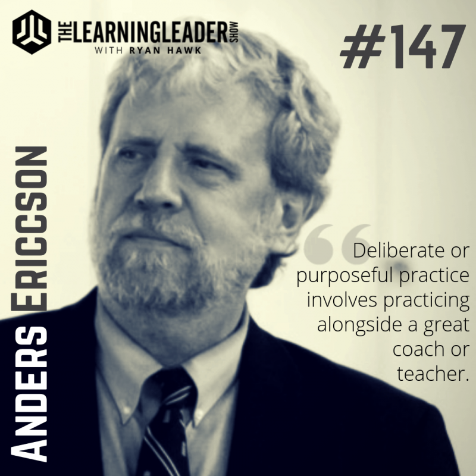

# 30Days_Of_Learning
A journal showing all the new things i would have learnt from March 1 - March 30 2025  

 Day 1 - March 1, 2025 
  

#### Goal For Today: Learn Advanced Excel Functions  

#### What I Learned Today:  
* I learnt how to apply VLOOKUP function to a data table in Excel.  
* I also learned how to apply XLOOKUP function to a data table in Excel.  
* I learnt how to use the TODAY function to get add a Date column to an Excel table, as well as how to use the NOW function to provide Date in Timestamp form.  
#### Challenge Faced:
* The XLOOKUP function was not available in my Excel version (Excel 2019).  
#### How I Overcame Challenges:  
* I had to use Excel on the Web where i could easily use the function to practice.  
#### Practice:  
* I applied the VLOOKUP and XLOOKUP functions to a table in order to find out the prices of Sugar Cookie and Chocolate Chip.  

  

* I practiced how to use the TODAY and NOW functions.  

#### Reflection:  
* Even though the VLOOKUP is quite useful, the XLOOKUP seems easier to use because it focuses more on columns, therefore, making it easier to capture targeted detail(s).  

  

  

 Day 2 - March 2, 2025 
  

### Goal For Today: Understanding The Data Analysis Process  

  

#### What I Learned Today:  
* I learnt that there are rules that guide the actions of every data analyst from the moment they are tasked with a problem till they present their findings to stakeholders.  
* I realized that some stages tend to overlap and may be repetitive, for instance, the Data Cleaning phase. Still on the Data Cleaning phase, i learnt that data analysts must always bear in mind that all data gathered/sourced for any project/task are never clean enough and so must ensure that even though the data is not thoroughly cleaned, it should be far cleaner than when they had first received them.  
* I learnt that even though there are numerous tools for data analysis at the disposal of the analyst, they must ensure that the tools they choose for the analytical process must be compatible with the data sourced.  
* i also learnt that data visualization options must be applied with their target audience at heart. In otherwords, the choice of data visualization must be easy to understand by the target audience so that the analytical process can be more meaningful.  
* I learnt that communicating facts that have been gleamed from the data must be conducted in very comprehensible language so that the target audience can understand the message being passed.  

#### Reflections:  
A data analyst's job is never done until the message is perfectly understood by the target audience. Therefore, we should as much as we can ensure that people comprehend what we are doing, else, the entire process would be meaningless.  

  

  

 Day 3 - March 3, 2025 
  
### Goal For Today: The 10,000-hour rule  

  

  

#### What I Learned Today:  
* I learnt that Anders Ericsson, a psychologist, posited that for anyone to be great at something, they have to dedicate a minimum of 10,000 hours to learning that thing. In other words, if you want to be great at something, you have to put in a minimum of 10,000 hours of deliberate, structured, and focused practice. His research helps us to learn and improve easier and much faster. But it all depends on just how far you are willing to go at that thing, and provided the rules guiding it (that new thing you are learning) do not change.  
This theory was made popular by Malcolm Gladwell.  

#### Reflection:  
To be better than 95% of people in an industry, i need to dedicate a minimum of 18 minutes of focused learning per day at one thing.  

  

  

 Day 4 - March 4, 2025 

### Goal For Today: How data is the oil of the 21st century  

  

  

#### What I Learnt Today:  
"Information is the oil of the 21st century, and analytics is the combustion engine " - Peter Sondergaard.

By this comparison, the importance of data and its processing in the 21st century is made clear.
Oil was the most importance resource of the 20th century. Today, data is the most valuable resource. And just as oil is of little relevance until refined, the true value of data remains untapped until it gets analyzed. Similarly, as a combustion engine transforms oil into energy, data analytics transforms information into insights that drive decisions, and give a competitive edge.
So, all economic agents (individuals, businesses, governments, etc) rely on data for a competitive edge.  

  

 Day 5 - March 5, 2025  
  
### Goal For Today: How your choice of browser reflects your I/Q  

  

#### What I Learnt Today:  
According to an online article at theatlantic.com, Chrome and Firefox Users Make Better Employees! This is a surprising finding but has been discussed in a few informal studies or surveys. While no definitive large-scale academic study has made this claim, it's often shared through articles on sites like Harvard Business Review or Medium, where correlations between browsing behavior and work performance have been speculated. You might find these mentioned in business or workplace studies on productivity and technology adoption.  
So, which browser are you using?  

  

  

 Day6 - March 6, 2025 
  
### Goal For Today:  Crime Organizations Of The Past And The Current Wealth Of Rich Countries  

  

  

#### What I Learnt Today:  
The relationship between past crime organizations and current economic development in rich countries is multifaceted. Historically, organized crime has often thrived in environments where central governments and civil society are disorganized, weak, or untrustworthy. This can occur during periods of political, economic, or social turmoil or transition, such as changes in government or rapid economic development.  

In many rich countries, the legacy of organized crime can be seen in several ways:  
Economic Impact: Organized crime groups have historically engaged in a variety of illegal activities, including drug trafficking, money laundering, and fraud. These activities can distort economic markets, divert resources from productive uses, and create inefficiencies. For example, the United States Drug Enforcement Administration (DEA) has identified Mexican transnational criminal organizations (TCOs) as the greatest criminal drug threat to the United States, highlighting their dominance in drug trafficking.  
Institutional Weakness: The presence of organized crime can weaken institutions, including law enforcement and the judiciary. This can lead to a lack of trust in these institutions, which is crucial for economic development. Strong and trustworthy institutions are essential for maintaining the rule of law, protecting property rights, and ensuring a stable business environment.  
Social Control: Criminal organizations often seek to develop social control over specific communities, which can lead to a parallel system of governance. This can undermine the legitimacy of the state and create areas where the state has limited influence. For instance, in some regions, criminal groups provide protection and social services, which can make it difficult for the state to regain control.  
Economic Inequality: There is compelling evidence that economic inequality is positively correlated with crime. Economic inequality can alienate individuals from societal institutions and values, leading to social resistance and engagement in criminal behavior. This relationship has been studied in various contexts, including developed countries, where economic inequality can contribute to higher crime rates.  
Historical Context: In some cases, the historical presence of organized crime has left a lasting impact on the economic and social fabric of a country. For example, the legacy of the Italian Mafia in Italy and the Yakuza in Japan has influenced the development of these countries' economies and social structures. These organizations have sometimes been integrated into legitimate business activities, creating a complex interplay between legal and illegal economies.  
Policy Implications: Understanding the historical relationship between organized crime and economic development is crucial for policymakers. Interventions that aim to reduce economic inequality and strengthen institutions can help mitigate the negative impacts of organized crime. For example, public participation programs and efforts to improve financial literacy can help reduce social resistance and the propensity for criminal behavior.
In summary, the relationship between past crime organizations and current economic development in rich countries is characterized by the impact of organized crime on economic markets, institutional strength, social control, and economic inequality. Addressing these issues is essential for fostering sustainable economic development and reducing the influence of organized crime.  

  

  

#### SOURCES:  
[The Guardian](https://www.theguardian.com/business/2025/mar/03/soaring-uk-crime-cost-up-policy-exchange-policing-prisons)  

[Global Initiative](https://globalinitiative.net/analysis/cross-cutting-threat-to-development/)  

[Lemonade](https://www.lemonde.fr/en/sports/article/2024/10/30/the-calabrian-mafia-s-hold-on-milan-s-football-stands_6730976_9.html)  

[Sage Pub](https://journals.sagepub.com/doi/10.1177/1088767907311849)  

[The Wall Street Journal](https://www.wsj.com/world/europe/europe-drugs-gangs-organized-crime-netherlands-6f58ea45)  

[Brookings](https://www.brookings.edu/articles/is-the-risk-of-crime-against-businesses-greater-in-more-unequal-countries/)  

  

