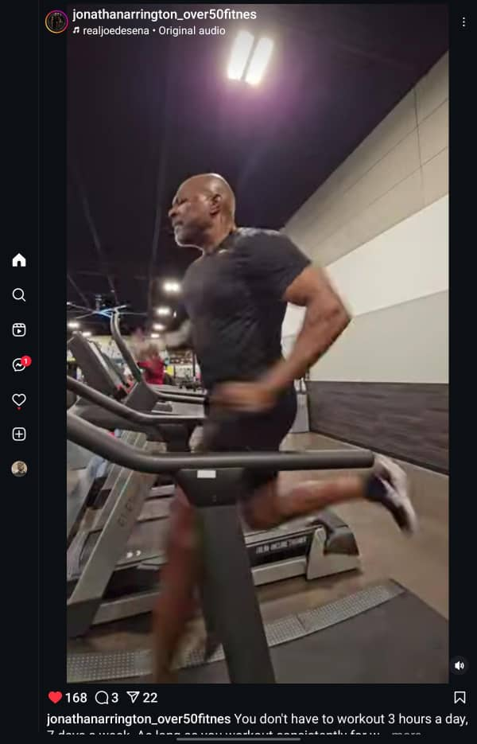

# 30Days_Of_Learning
A journal showing all the new things i would have ;learnt from March 1 - March 30 2025  

 Day 1 - March 1, 2025 
  

#### Goal For Today: Learn Advanced Excel Functions  

#### What I Learned:  
* I learnt how to apply VLOOKUP function to a data table in Excel.  
* I also learned how to apply XLOOKUP function to a data table in Excel.  
* I learnt how to use the TODAY function to get add a Date column to an Excel table, as well as how to use the NOW function to provide Date in Timestamp form.  
#### Challenge Faced:
* The XLOOKUP function was not available in my Excel version (Excel 2019).  
#### How I Overcame Challenges:  
* I had to use Excel on the Web where i could easily use the function to practice.  
#### Practice:  
* I applied the VLOOKUP and XLOOKUP functions to a table in order to find out the prices of Sugar Cookie and Chocolate Chip.  

  

* I practiced how to use the TODAY and NOW functions.  

#### Reflection:  
* Even though the VLOOKUP is quite useful, the XLOOKUP seems easier to use because it focuses more on columns, therefore, making it easier to capture targeted detail(s).  

  

  

 Day 2 - March 2, 2025 
  

### Goal For Today: Understanding The Data Analysis Process  

  

#### What I Learned Today:  
* I learnt that there are rules that guide the actions of every data analyst from the moment they are tasked with a problem till they present their findings to stakeholders.  
* I realized that some stages tend to overlap and may be repetitive, for instance, the Data Cleaning phase. Still on the Data Cleaning phase, i learnt that data analysts must always bear in mind that all data gathered/sourced for any project/task are never clean enough and so must ensure that even though the data is not thoroughly cleaned, it should be far cleaner than when they had first received them.  
* I learnt that even though there are numerous tools for data analysis at the disposal of the analyst, they must ensure that the tools they choose for the analytical process must be compatible with the data sourced.  
* i also learnt that data visualization options must be applied with their target audience at heart. In otherwords, the choice of data visualization must be easy to understand by the target audience so that the analytical process can be more meaningful.  
* I learnt that communicating facts that have been gleamed from the data must be conducted in very comprehensible language so that the target audience can understand the message being passed.  

#### Reflections:  
A data analyst's job is never done until the message is perfectly understood by the target audience. Therefore, we should as much as we can ensure that people comprehend what we are doing, else, the entire process would be meaningless.  

  

  

 Day 3 - March 3, 2025 
  
### Goal For Today: The 10,000-hour rule  

  

  

#### What I Learned Today:  
* I learnt that Ander Ericsson, a psychologist, posited that for anyone to be great at something, they have to dedicate a minimum of 10,000 hours to learning that thing. In other words, if you want to be great at something, you have to put in a minimum of 10,000 hours of deliberate, structured, and focused practice. His research helps us to learn and improve easier and much faster. But it all depends on just how far you are willing to go at that thing, and provided the rules guiding it (that new thing you are learning) do not change.  
This theory was made popular by Malcolm Gladwell.  

#### Reflection:  
To be better than 95% of people in an industry, i need to dedicate a minimum of 18 minutes of focused learning per day at one thing.  

